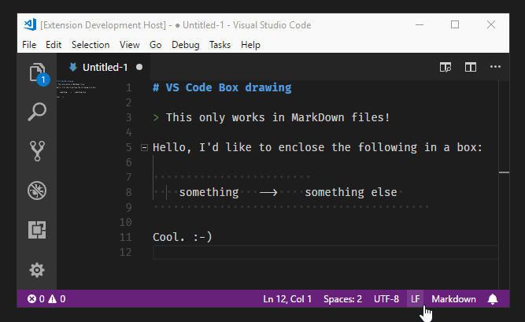

# Box Drawing

> A VS Code extension for simplifying box drawing with Unicode and ASCII.

This extension only works on MarkDown files!

## Features

## Extension Settings

No settings yet, a setting for Unicode (various styles) vs ASCII is being worked on.

## Release Notes

See the [changelog](CHANGELOG.md).
