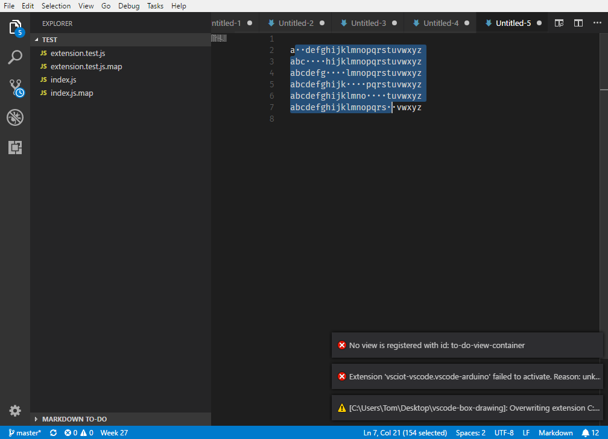

<!-- README.md is generated from README.template.md -->
# [MarkDown Box Drawing](https://marketplace.visualstudio.com/items?itemName=TomasHubelbauer.vscode-box-drawing)

> A VS Code extension for simplifying box drawing with Unicode and ASCII.

Unfortunately, due to VS Code API limitations, direct mouse drawing mode cannot be used and instead selections have to be utilized.

To alleviate the pain of using this mode, we'll soon bring in a command which pre-spaces a page of the document to make making selections convenient.

## Features

The commands are shown only in MarkDown files. You can configure the extension to either use ASCII or Unicode drawing characters.

### Clearing the canvas

TODO

### Drawing a box

Start with a document formatted so that you can make a rectangular selection about the desired area. You can use the *Insert a drawing canvas* for this.

Make your selection enclosing the area you want to draw the box around…

Execute the *Draw a box enclosing the selection* command. Here's your box!

### Drawing an arrow

TODO

## Release Notes

See the [change log](CHANGELOG.md).

## Contributing

See the [contributor's guide](CONTRIBUTING.md).
