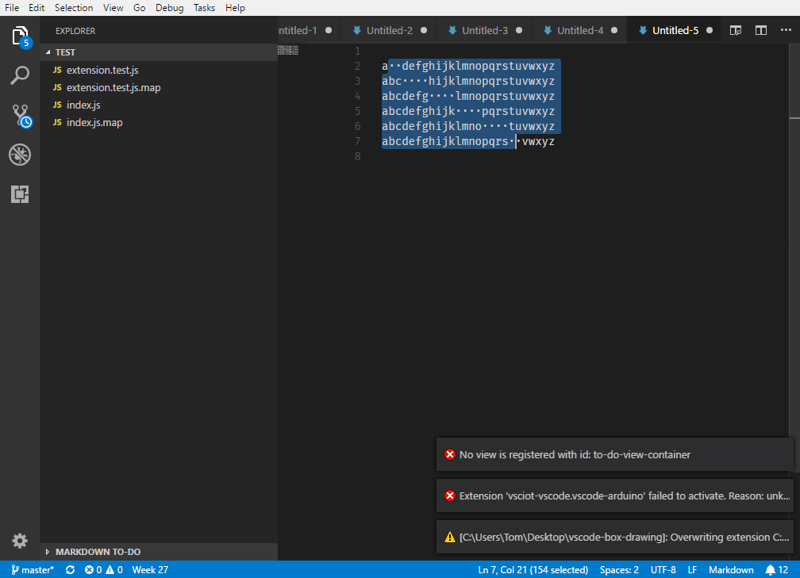
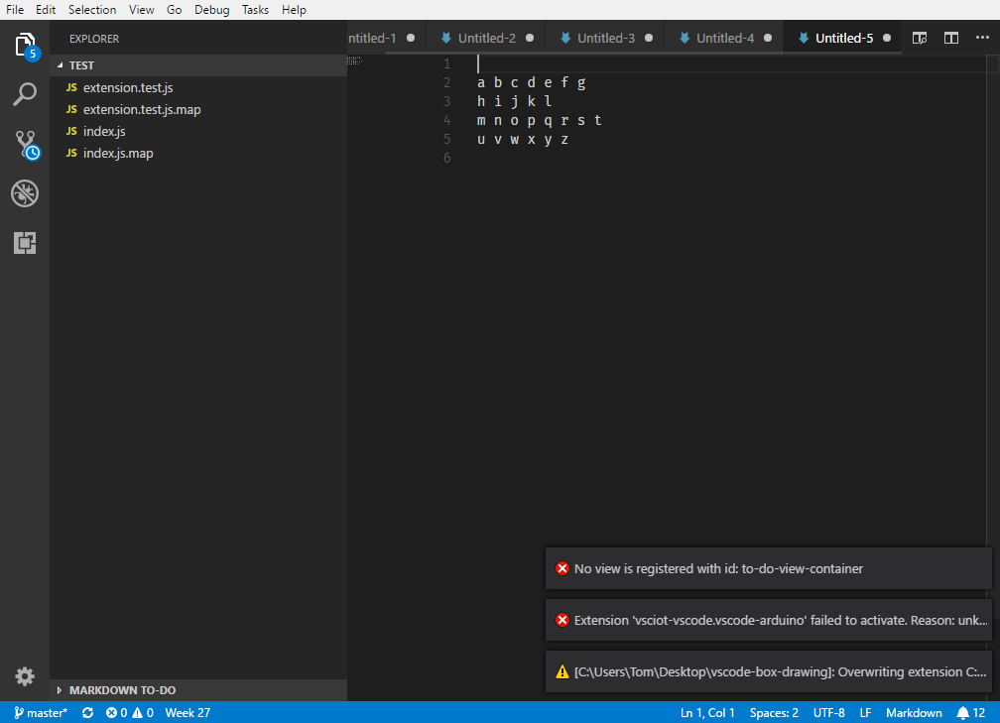
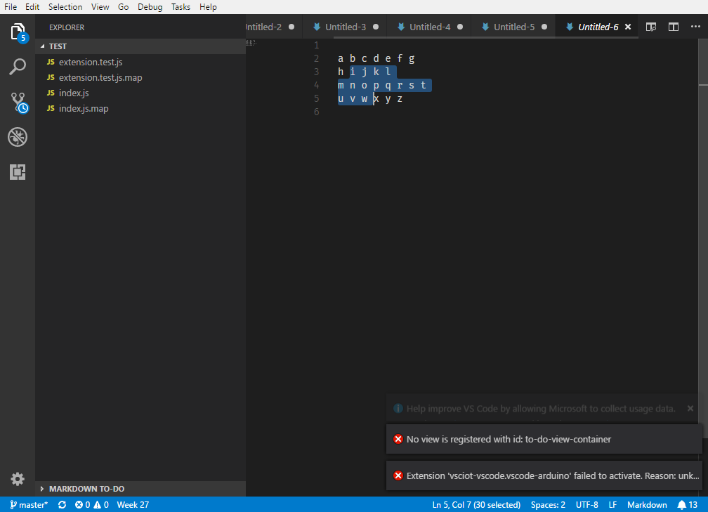

## Features

The commands are shown only in MarkDown files. You can configure the extension to either use ASCII or Unicode drawing characters.

### Clearing the canvas

TODO

### Drawing a box

Start with a document formatted so that you can make a rectangular selection about the desired area. You can use the *Insert a drawing canvas* for this.

Make your selection enclosing the area you want to draw the box around…

Execute the *Draw a box enclosing the selection* command. Here's your box!

### Drawing an arrow

TODO

